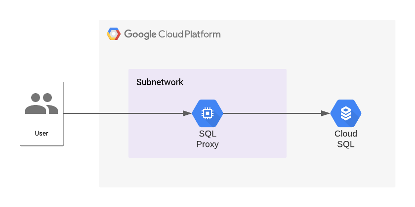

# Cloud SQL Proxy

## Architecture

In order to connect to a Cloud SQL instance with a private IP address, you can use the [Cloud SQL proxy](https://github.com/GoogleCloudPlatform/cloudsql-proxy).  It's not possible to run this on your local machine, as the proxy requires access to the private IP address.  To solve that, you can run it on a VM and use that as a jump box to connect to the Cloud SQL instance.



To make this example more realistic, we run the Cloud SQL instance in a Shared VPC, as this is normally the setup most Enterprise customers have configured. This way, we can clearly share what resources are running in which project (host and service).  

## IAM Permissions

To grant access to the proper IAM permissions, the module offers the ability to create a custom role.  Identities have to be able to a) retrieve the instance details (`compute.instances.get`) and to update the metadata, in case they want to upload their SSH keys (`compute.instances.setMetadata`) if they want to access the VM over SSH.  

As we want to apply the principle of least privilege, we apply those IAM permissions at instance level and not at project level.  Otherwise, identities gain access to *all* the VMs in the project. 

If the identity running the Terraform code doesn't have the necessary permissions, the custom role is not created and the role Instance Admin is granted on the instance itself.

## How To Run

To be able to run this example, you need the necessary permissions to create projects and a shared vpc.

### Create

Create a `terraform.tfvars`-file in this directory, with the following variables:

| Variable           |  Type  | Description                                                                                                                          |
|--------------------|:------:|--------------------------------------------------------------------------------------------------------------------------------------|
| organization_id    | string | The ID of the GCP organization.                                                                                                      |
| billing_account_id | string | ID of the Billing Account.                                                                                                           |
| parent_folder_id   | string | The ID of the parent folder.                                                                                                         |
| identity           | string | The user id of the person who is running the Terraform commands. This is the identity who will be accessing the proxy and database.  |
| prefix             | string | The prefix that will be used for nearly all resources.  This will be the prefix for the project names and IDs, amongst other things. |

Run the following commands to create the target environment.

```shell
# Initialise Terraform in this directory
terraform init

# Apply Terraform
terraform apply -auto-approve
```

This will create all the resources, depicted in the diagram.  It will also create a `backend.tf`-file, which contains the necessary information to copy your Terraform state to a GCS bucket.  If you want that, you will have to run `terraform init` again in the same directory and input `yes` when asked to copy the state remotely.  However, if you want to skip that, there is no need to execute that last step.

### Access

To access the environment, open two terminal windows and run the following commands:
1. IAP Tunnel: `$(terraform output -json | jq -r .start_iap_tunnel.value)`
2. PSQL: `terraform output -json | jq -r .sql_client_command.value | pbcopy`

Because of the double quotes, the command is copied to your cache and you can paste it in the terminal window. To retrieve the password for the database, run `$(terraform output -json | jq -r .retrieve_db_password.value) | pbcopy` and copy/paste it where you ran the `PSQL`-command (second terminal).

### Destroy

To destroy the environment, remove `backend.tf` and re-initialise terraform again.  When asked to copy the remote state to your local environment, enter `yes`.  Once done, run `terraform destroy -auto-approve`.  This will tear down the entire environment.

## Variables

| Variable                | Type   | Default        | Description                                                                                                                                                                                                                                                                               |
|-------------------------|--------|----------------|-------------------------------------------------------------------------------------------------------------------------------------------------------------------------------------------------------------------------------------------------------------------------------------------|
| region                  | string | europe-west1   | Default region for all resources.                                                                                                                                                                                                                                                         |
| zone                    | string | europe-west1-b | Default zone for all resources.                                                                                                                                                                                                                                                           |
| block_egress            | bool   | false          | The VM only gets a private IP address, so it needs routing to the public internet to install all updated packages and the Cloud SQL proxy.  Once everything is created, you can delete those resources by setting this value to `true` and running `terraform apply -auto-approve` again. |
| block_ssh               | bool   | true           | By default, SSH access is blocked.  If you need access to the VM, set this value to false so you can create the necessary firewall rules.                                                                                                                                                 |
| subnet_cidr_range       | string | 10.0.0.0/24    | The CIDR block for the subnet where the VM is created.                                                                                                                                                                                                                                    |
| cloud_sql_proxy_version | string | v1.21.0        | The version of the Cloud SQL proxy.                                                                                                                                                                                                                                                      |
## Outputs

Most of the outputs are commands that can be run to establish connectivity towards the Cloud SQL instance.  You can run these in a shell, via `$(terraform output -json | jq -r .OUTPUT_VAR_NAME.value`, replacing `OUTPUT_VAR_NAME` with the name of the output.

| Name                         | Description                                                   |
|------------------------------|---------------------------------------------------------------|
| start_ssh_tunnel             | Command to start an SSH connection to the Cloud SQL proxy VM. |
| sql_instance_connection_name | The connection name for the Cloud SQL instance.               |
| start_iap_tunnel             | Command to open a TCP IAP tunnel to the VM, on port 5432.     |
| sql_client_command           | PSQL command to connect to the database, via the proxy.       |
| host_network_project_id      | The project ID of the host project.                           |
| service_network_project_id   | The project ID of the service project.                        |
| retrieve_db_password         | Command to retrieve the password for the database.            |

## Resources
### cloud_sql.tf
This file contains all the resources to create the Cloud SQL instance with a private IP address.  

| Resource                                                               | Purpose                                                                                                                                                                                                                                                                                 |
|------------------------------------------------------------------------|-----------------------------------------------------------------------------------------------------------------------------------------------------------------------------------------------------------------------------------------------------------------------------------------|
| google_compute_global_address                                          | IP address range for the [Private Services Access](https://cloud.google.com/vpc/docs/configure-private-services-access).                                                                                                                                                                |
| google_service_networking_connection                                   | Private Services Access connection.                                                                                                                                                                                                                                                     |
| google_sql_database_instance                                           | The SQL database instance. Even though the instance is created in the service project, the network from the host project should be used for the `ip_configuration`.  Because `ipv4_enabled` is set to false, no public IP address is assigned.                                          |
| google_sql_database                                                    | The database that is created in the DB instance.                                                                                                                                                                                                                                        |
| google_sql_user                                                        | User created to access the database.  For Postgres, IAM access can be used.  However, this has implications for the Cloud SQL proxy, so I chose to generate a DB user instead.                                                                                                          |
| random_password                                                        | Generated password for the SQL user.                                                                                                                                                                                                                                                    |
| google_secret_manager_secret and  google_secret_manager_secret_version | Secret Manager secret to store the password and make sure other identities and GCP resources can access it.                                                                                                                                                                             |
| google_secret_manager_secret_iam_member                                | To grant access to the secret to the identity referenced in the variables, the role  `roles/secretmanager.secretAccessor` is granted *on the secret* itself.  If this is granted at project level, identities gain access to **all** the secrets in that project, which is less secure. |

### 
