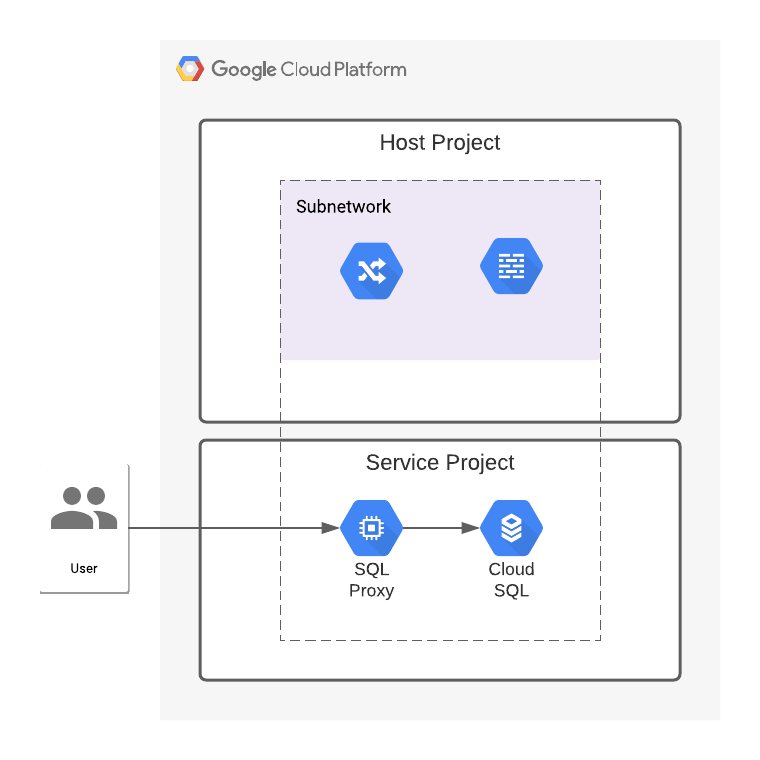

# Cloud SQL Proxy

The purpose of this code sample is to demonstrate how to use the Cloud SQL proxy to talk to a Cloud SQL database with a private IP address, as illustrated in the diagram below.

## Resources

## How to build