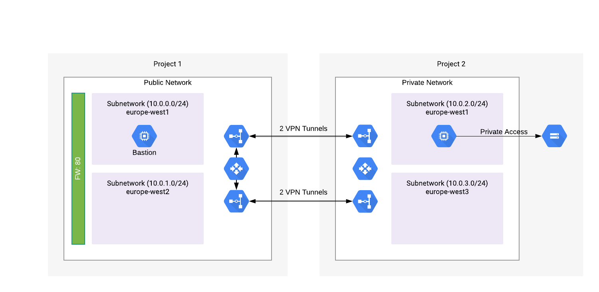

# HA VPN Tunnel

This research was put together by following the [official documentation](https://cloud.google.com/vpn/docs/how-to/creating-ha-vpn2) and a Terraform code [https://www.terraform.io/docs/providers/google/r/compute_ha_vpn_gateway.html](example).

## TL;DR
When creating the Interface and Peer resources, the Peering IP address has to come out of the IP range configured on the other end.  For the VM in project 2 to access GCS (= public API), private access has to be enabled on the Subnet.

## Architecture


There is 1 Bastion host, that allows access on port 22, to allow SSH access.  The second VM only allows access to the SA in use by the Bastion host, to ensure no other VMs can login.  Thanks to Private Access, the second VM can access the GCS bucket.

## Resources
The Terraform files create the following resources:
* 2 Projects.
* 2 Networks, 1 in each project.
* 4 Subnets, 2 in each project.
* 2 Cloud Routers, 1 in each project.
* 2 VPN Gateways, 1 in each project.
* 4 VPN tunnels, 2 between each gateway.
* 2 VMs, 1 in each project.
* GCS bucket, only accessible over private access.
* 2 Service Accounts, 1 for each VM.

### Projects
Projects were created by using the Project module in tf-modules.  For more information, please refer to that repository. Only `compute.googleapis.com` has to be enabled for this setup.

### Networks

Following characteristics:
* Subnets are created manually.
* VPC flow logs are enabled, by adding the `log_config`-block

#### Network 1

```hcl-terraform
resource "google_compute_network" "public_vpc_1" {
  name                    = "public-vpc-1"
  project                 = module.project_vpc_1.project_id
  auto_create_subnetworks = false
}

resource "google_compute_subnetwork" "public_subnet_1" {
  ip_cidr_range = "10.0.0.0/24"
  name          = "sn-eu-west-1"
  network       = google_compute_network.public_vpc_1.self_link
  region        = "europe-west1"
  description   = "Subnet which will be connected to the other network via VPN"

  project = module.project_vpc_1.project_id

  log_config {
    aggregation_interval = "INTERVAL_5_SEC"
    flow_sampling        = "1.0"
    metadata             = "INCLUDE_ALL_METADATA"
  }
}

resource "google_compute_subnetwork" "public_subnet_2" {
  ip_cidr_range = "10.0.1.0/24"
  name          = "sn-eu-west-2"
  network       = google_compute_network.public_vpc_1.self_link
  region        = "europe-west2"
  description   = "Subnet which will be connected to the other network via VPN"

  project = module.project_vpc_1.project_id

  log_config {
    aggregation_interval = "INTERVAL_5_SEC"
    flow_sampling        = "1.0"
    metadata             = "INCLUDE_ALL_METADATA"
  }
}
```

#### Network 2
```hcl-terraform
resource "google_compute_network" "private_vpc_2" {
  name                    = "private-vpc-2"
  project                 = module.project_vpc_2.project_id
  auto_create_subnetworks = false
}

resource "google_compute_subnetwork" "private_subnet_1" {
  ip_cidr_range = "10.0.2.0/24"
  name          = "sn-eu-west-1"
  region        = "europe-west1"
  network       = google_compute_network.private_vpc_2.self_link
  description   = "Subnet which will be connected to the other network via VPN"

  project = module.project_vpc_2.project_id

  log_config {
    aggregation_interval = "INTERVAL_5_SEC"
    flow_sampling        = "1.0"
    metadata             = "INCLUDE_ALL_METADATA"
  }

  private_ip_google_access = true
}

resource "google_compute_subnetwork" "private_subnet_2" {
  ip_cidr_range = "10.0.3.0/24"
  name          = "sn-eu-west-3"
  region        = "europe-west3"
  network       = google_compute_network.private_vpc_2.self_link
  description   = "Subnet which will be connected to the other network via VPN"

  project = module.project_vpc_2.project_id

  log_config {
    aggregation_interval = "INTERVAL_5_SEC"
    flow_sampling        = "1.0"
    metadata             = "INCLUDE_ALL_METADATA"
  }

  private_ip_google_access = true
}
```

### VPN Gateways
VPN Gateways to connect both projects over VPN.  To make sure we have 99.99% SLA, there will be 4 tunnels in total, 2 between each VPN Gateway.

They have to be in the same region as the one used for the Cloud Routers.

#### VPN Gateway 1
```hcl-terraform
resource "google_compute_ha_vpn_gateway" "gw_vpc_1" {
  provider = google-beta
  project  = module.project_vpc_1.project_id

  network     = google_compute_network.public_vpc_1.self_link
  name        = "gw-vpc-1"
  description = "VPN Gateway VPC 1."
  region      = "europe-west1"
}
```

#### VPN Gateway 2
```hcl-terraform
resource "google_compute_ha_vpn_gateway" "gw_vpc_2" {
  provider = google-beta
  project  = module.project_vpc_2.project_id

  network     = google_compute_network.private_vpc_2.self_link
  name        = "gw-vpc-2"
  description = "VPN Gateway VPC 2."
  region      = "europe-west1"
}
```

### Cloud Routers
One Cloud Router in each project, which will be connected to the VPN gateways.

#### Cloud Router 1
```hcl-terraform
resource "google_compute_router" "cr_vpc_1" {
  project = module.project_vpc_1.project_id

  network     = google_compute_network.public_vpc_1.self_link
  name        = "cr-vpc-1"
  description = "Cloud Router VPC1, region europe-west1"
  region      = "europe-west1"

  bgp {
    asn = 65001
  }
}
```

#### Cloud Router 2 
```hcl-terraform
resource "google_compute_router" "cr_vpc_2" {
  project = module.project_vpc_2.project_id

  network     = google_compute_network.private_vpc_2.self_link
  name        = "cr-vpc-2"
  description = "Cloud Router VPC2, region europe-west1."
  region      = "europe-west1"

  bgp {
    asn = 65002
  }
}
```
### VPN Tunnels
There are 2 tunnels per Gateway, to ensure HA setup.  They connect interface 0 and interface 1 on both Gateways with each other.  You can use different Secrets per tunnel, just make sure you use the same secret on both ends. 

So, for example, if Gateway 1 - Interface 0 has secret "This is a test", you have to configure the same secret on Gateway 2, Interface 0.  There aren't strict rules around generating a secret, but I used `openssl rand -base64 24 | pbcopy`, which is one of the official recommendations.

As HA VPN is still in beta, you'll have to use the *beta* provider for Terraform.  

#### Gateway 1
```hcl-terraform
## Gateway 1, Tunnel 0
resource "google_compute_vpn_tunnel" "vpn_tunnel_gw1_int0" {
  provider = google-beta
  project  = module.project_vpc_1.project_id

  name                  = "vpn-tunnel-gw1-int0"
  region                = "europe-west1"
  router                = google_compute_router.cr_vpc_1.self_link
  vpn_gateway           = google_compute_ha_vpn_gateway.gw_vpc_1.self_link
  peer_gcp_gateway      = google_compute_ha_vpn_gateway.gw_vpc_2.self_link
  shared_secret         = "W0jYlpRWM2Y1hfUy9NucPVAscLBnowFh"
  vpn_gateway_interface = 0
}

## Gateway 1, Tunnel 1
resource "google_compute_vpn_tunnel" "vpn_tunnel_gw1_int1" {
  provider = google-beta
  project  = module.project_vpc_1.project_id

  name                  = "vpn-tunnel-gw1-int1"
  region                = "europe-west1"
  router                = google_compute_router.cr_vpc_1.self_link
  vpn_gateway           = google_compute_ha_vpn_gateway.gw_vpc_1.self_link
  peer_gcp_gateway      = google_compute_ha_vpn_gateway.gw_vpc_2.self_link
  shared_secret         = "LYpL4ppRkb0kUGnWn8txxeZC1XQ0xCFD"
  vpn_gateway_interface = 1
}
```
#### Gateway 2
```hcl-terraform
## Gateway 2, Tunnel 0
resource "google_compute_vpn_tunnel" "vpn_tunnel_gw2_int0" {
  provider = google-beta
  project  = module.project_vpc_2.project_id

  name                  = "vpn-tunnel-gw2-int0"
  region                = "europe-west1"
  router                = google_compute_router.cr_vpc_2.self_link
  vpn_gateway           = google_compute_ha_vpn_gateway.gw_vpc_2.self_link
  peer_gcp_gateway      = google_compute_ha_vpn_gateway.gw_vpc_1.self_link
  shared_secret         = "W0jYlpRWM2Y1hfUy9NucPVAscLBnowFh"
  vpn_gateway_interface = 0
}

## Gateway 2, Tunnel 1
resource "google_compute_vpn_tunnel" "vpn_tunnel_gw2_int1" {
  provider = google-beta
  project  = module.project_vpc_2.project_id

  name                  = "vpn-tunnel-gw2-int1"
  region                = "europe-west1"
  router                = google_compute_router.cr_vpc_2.self_link
  vpn_gateway           = google_compute_ha_vpn_gateway.gw_vpc_2.self_link
  peer_gcp_gateway      = google_compute_ha_vpn_gateway.gw_vpc_1.self_link
  shared_secret         = "LYpL4ppRkb0kUGnWn8txxeZC1XQ0xCFD"
  vpn_gateway_interface = 1
}
```
### Interfaces and BGP Peer
Once all this in place, you need to enable communication on both ends of the tunnels.  This means that you have to create an interface on the Cloud Router, which allows communication.  The second step is to enable the BGP peering session.  Once this is in place, the handshake happens and the BGP peering session is established.

This was the part where I struggled the most.  The documentation wasn't very clear on what you need to do in terms of IP addresses.  Each interface is configured with a /30 block, coming from the range 169.254.0.0/16.  The corresponding peer **on the other side** has to be configured with an ip address coming from the /30 block on the interface on the other side.

This is a table to make it more clear:

|               | Cloud Router 1   | Cloud Router 2   |
|---------------|------------------|------------------|
| *Interface 0* | 169.254.100.1/30 | 169.254.100.2/30 |
| *Peer 0*      | 169.254.100.2    | 169.254.100.1    |
| *Interface 1* | 169.254.200.1/30 | 169.254.200.2/30 |
| *Peer 1*      | 169.254.200.2    | 169.254.200.1    |

As you can see, it cross references the IP range configured at the other end of the tunnel, when selecting the IP address of the Peer.

When configuring the ASN, you have to pick the ASN that was configured on the other end of the tunnel, as you are establishing the connection with the other end of the tunnel.

#### Tunnel 0
```hcl-terraform
## Cloud Router 1, Interface 0
resource "google_compute_router_interface" "cr1_int0_to_gw2_int0" {
  provider = google-beta
  project  = module.project_vpc_1.project_id

  name       = "router1-interface0"
  router     = google_compute_router.cr_vpc_1.name
  region     = "europe-west1"
  ip_range   = "169.254.100.1/30"
  vpn_tunnel = google_compute_vpn_tunnel.vpn_tunnel_gw1_int0.self_link
}

resource "google_compute_router_peer" "cr1_int0_to_gw2_int0_peer" {
  provider = google-beta
  project  = module.project_vpc_1.project_id

  name                      = "router1-int0-peer"
  router                    = google_compute_router.cr_vpc_1.name
  interface                 = google_compute_router_interface.cr1_int0_to_gw2_int0.name
  region                    = "europe-west1"
  peer_ip_address           = "169.254.100.2"
  peer_asn                  = 65002
  advertised_route_priority = 100
}

## Cloud Router 2, Interface 0
resource "google_compute_router_interface" "cr2_int0_to_gw1_int0" {
  provider = google-beta
  project  = module.project_vpc_2.project_id

  name       = "router2-interface0"
  router     = google_compute_router.cr_vpc_2.name
  region     = "europe-west1"
  ip_range   = "169.254.100.2/30"
  vpn_tunnel = google_compute_vpn_tunnel.vpn_tunnel_gw2_int0.self_link
}

resource "google_compute_router_peer" "cr2_int0_to_gw1_int0_peer" {
  provider = google-beta
  project  = module.project_vpc_2.project_id

  name                      = "router2-int0-peer"
  region                    = "europe-west1"
  router                    = google_compute_router.cr_vpc_2.name
  interface                 = google_compute_router_interface.cr2_int0_to_gw1_int0.name
  peer_ip_address           = "169.254.100.1"
  peer_asn                  = 65001
  advertised_route_priority = 100
}
```

#### Tunnel 1
```hcl-terraform
## Cloud Router 1, Interface 1
resource "google_compute_router_interface" "cr1_int1_to_gw2_int1" {
  provider = google-beta
  project  = module.project_vpc_1.project_id

  name       = "router1-interface1"
  router     = google_compute_router.cr_vpc_1.name
  region     = "europe-west1"
  ip_range   = "169.254.200.1/30"
  vpn_tunnel = google_compute_vpn_tunnel.vpn_tunnel_gw1_int1.self_link
}

resource "google_compute_router_peer" "cr1_int1_to_gw2_int1_peer" {
  provider = google-beta
  project  = module.project_vpc_1.project_id

  name                      = "router1-int1-peer"
  region                    = "europe-west1"
  router                    = google_compute_router.cr_vpc_1.name
  interface                 = google_compute_router_interface.cr1_int1_to_gw2_int1.name
  peer_ip_address           = "169.254.200.2"
  peer_asn                  = 65002
  advertised_route_priority = 100
}

## Cloud Router 2, Interface 1
resource "google_compute_router_interface" "cr2_int1_to_gw1_int1" {
  provider = google-beta
  project  = module.project_vpc_2.project_id

  name       = "router2-interface1"
  router     = google_compute_router.cr_vpc_2.name
  region     = "europe-west1"
  ip_range   = "169.254.200.2/30"
  vpn_tunnel = google_compute_vpn_tunnel.vpn_tunnel_gw2_int1.self_link
}

resource "google_compute_router_peer" "cr2_int1_to_gw1_int1_peer" {
  provider = google-beta
  project  = module.project_vpc_2.project_id

  name                      = "router2-int1-peer"
  region                    = "europe-west1"
  router                    = google_compute_router.cr_vpc_2.name
  interface                 = google_compute_router_interface.cr2_int1_to_gw1_int1.name
  peer_ip_address           = "169.254.200.1"
  peer_asn                  = 65001
  advertised_route_priority = 100
}
```


