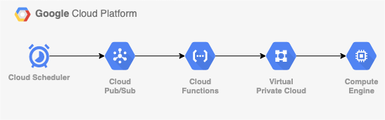

# Serverless Healthcheck

Sometimes applications are run on a VM and expose a health check endpoint that requires more intelligence than just looking for HTTP code 200.  For example, some commerciall off-the-shelf applications for example run several internal services, and the healthchecks returns a JSON or XML file that gives an overview of each individual service. 

This can't be solved by adding a load balancer in front of the application, because HTTP code 200 just means that the healt check is up and running.  It could very well be that a number of internal services are in a degraded state.  To get around that, this solution provides a Cloud Native way to ping an HTTP health point and analyses the response.  Additionally, it uses Serverless VPC Access to ping a VM with a private IP address.

## Architecture


The Compute instance runs in a shared VPC and is not exposed publicly.  

## Implementation
### Networks

```terraform
resource "google_compute_shared_vpc_host_project" "host" {
  project = module.host_project.project_id
  depends_on = [
    module.host_project.project_id
  ]
}

resource "google_compute_shared_vpc_service_project" "mon_service" {
  host_project    = module.host_project.project_id
  service_project = module.service_project.project_id

  depends_on = [
    google_compute_shared_vpc_host_project.host,
    module.service_project
  ]
}

resource "google_compute_network" "host_network" {
  project = module.host_project.project_id

  name = "host-network"
  depends_on = [
    google_compute_shared_vpc_service_project.mon_service
  ]
}

resource "google_compute_subnetwork" "host_subnetwork" {
  project = module.host_project.project_id

  ip_cidr_range = "10.0.0.0/16"
  name          = "eu-west1-sn"
  network       = google_compute_network.host_network.self_link
  region        = "europe-west1"
}
```

