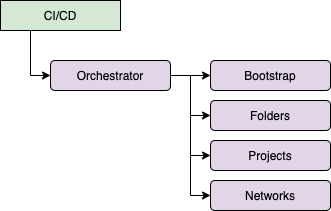

# Service Account Impersonation

On GCP, CI/CD pipelines are executed via service accounts.  These are the identities that are used to access the APIs exposed by the platform to create and manage resources in your organization.  Quite often these CI/CD tools are external to GCP.  This could either be SaaS offerings, like CircleCI, or tools hosted on-premise who are accessing your environment over a private connection.

The main concern with this approach is that you need to download and upload a service account key to make sure that the identity can authenticate with GCP.  As you may be aware, these keys can be compromised or accidentally uploaded to a public source repository, which opens up your GCP organization to hackers, depending on the permissions that are assigned to the identity.

Additionally, it's never a good idea to have one **God identity** which is responsible for all your operations.  The recommendation is to seggregate IAM permissions, to ensure that individual identities have a small and dedicated focus.  This ensures that IAM permissions are not overprovisioned, hence making the overall environment more secure if one of these identities is compromised.

## Approach

### Design

To visualise the approach, this is a small diagram that explains the necessary components:



As you can see, the CI/CD pipeline uses an orchestrator service account, which has very limited IAM permissions.  It can read from the storage bucket that contains the Terraform state and it can impersonate the other service accounts you see on the diagram.  Those individual service accounts possess the permissions to create the necessary infrastructure resources.

### Layers

As you can see in the Design-section, you split the overall platform orchestration in separate sections.  Each individual section has its own identity to manage the different resources.  How to arrive at a certain split is subject to how the platform is orchestrated in general and how your teams use GCP.  There isn't a standard approach that can be copy/pasted and implemented, with limited adaptations.

As a rule of thumb, try to limit the dependencies between the different layers.  Otherwise you will have to implement dependencies between your build pipelines, which can trip you up later on, when the organisation grows.  

## Implementation

In order to allow service accounts to impersonate other service accounts, they will need the `roles/iam.serviceAccountTokenCreator`-role on the identity.  This allows them to generate an access token for that particular service account.  

```terraform
resource "google_service_account_iam_member" "project_impersonation_orchestrator" {
  member             = "serviceAccount:${google_service_account.bootstrap_orchestrator.email}"
  role               = "roles/iam.serviceAccountTokenCreator"
  service_account_id = google_service_account.project_creation_orchestrator.id
}
```

Once these permissions have been applied, the bootstrap orchestrator will be able to execute calls to the GCP APIs **via** the project creation orchestrator. 

The second step is to get an authentication token that can be used to authenticate with the APIs.  

```terraform
data "google_service_account_access_token" "default" {
  provider               = google.impersonated
  scopes                 = ["userinfo-email", "cloud-platform"]
  target_service_account = "xyz@iam.gserviceaccount.com"
  lifetime               = "1800s"
}

provider "google" {
  alias = "impersonated"
}

provider "google" {
  region            = var.region
  zone              = var.zone
  access_token      = data.google_service_account_access_token.default.access_token
}

provider "google-beta" {
  region            = var.region
  zone              = var.zone
  access_token      = data.google_service_account_access_token.default.access_token
}
```

The reason you see two providers is that you are in a catch-22 situation here.  In order to generate an access token, you have to have a provider configured.  So, to achieve this, we configure two dummy providers, with `alias = "impersonated"`.  The sole purpose for these is to be able to get an access token.  All subsequent calls will pass via the regular provider and authentication will happen via impersonation.

