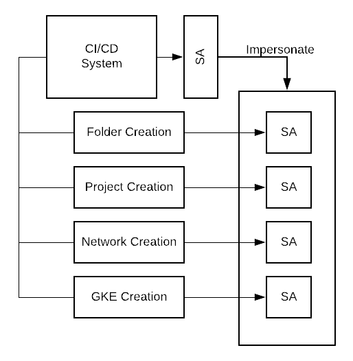

# Service Account Impersonating

When running Terraform pipelines in GCP, a service account has to be attached to the process.  When using Cloud Build, the main Cloud Build service account is used. It's not a great idea to have one service account orchestrating all your resources.  Partially because Terraform runs into performance issues when it has to manage a large number of resources.  Another reason is that one service account needs all the permissions to create resources, which is too big of a risk.

As a solution, you can split your deployment in multiple focus areas and assign a focused service account to each individual focus area.  However, Cloud Build still uses the main service account to run its deployments, so you need to tell the platform that it has to use the specific service accounts for each individual focus area.  That's where the datablock `google_service_account_access_token` comes into play.

## Architecture


## Service Account
Create the service account that will be responsible for the target action.  In this case, it's creating projects.  Depending on what value is provided, this member is created at organization or folder level.

```terraform
resource "google_service_account" "project_creator" {
  project      = google_project.cloud_build_project.project_id
  account_id   = "sa-project-creator"
  display_name = "Project Creator"
}

resource "google_organization_iam_member" "organization_project_creator" {
  count  = local.organization_id == null ? 0 : 1
  org_id = local.organization_id
  member = "serviceAccount:${google_service_account.project_creator.email}"
  role   = "roles/resourcemanager.projectCreator"
}

resource "google_folder_iam_member" "folder_project_creator" {
  count  = local.folder_id == null ? 0 : 1
  folder = local.folder_id
  member = "serviceAccount:${google_service_account.project_creator.email}"
  role   = "roles/resourcemanager.projectCreator"
}
```

## Impersonate Policy Binding
Next step, grant the Cloud Build service account the necessary permissions to impersonate the newly created service account.

```terraform
resource "google_service_account_iam_binding" "sa_cloud_build_impersonator" {
  service_account_id = "projects/${google_project.cloud_build_project.project_id}/serviceAccounts/${google_service_account.project_creator.email}"
  role               = "roles/iam.serviceAccountTokenCreator"
  members = [
    "serviceAccount:${local.cloud_build_sa}"
  ]
}
```

## Access Token
Configure a data-block that generates a token to impersonate a service account.  In the example the token lasts for 5 minutes, but this will vary depending on the use case you are trying to solve.  The scope of the token is `cloud-platform`.  This opens access to *all* APIs, but what the service account actually can do depends on the IAM permissions it is granted.

```terraform
data "google_service_account_access_token" "project_creator_access_token" {
  provider               = google
  scopes                 = ["cloud-platform", "userinfo-email"]
  target_service_account = google_service_account.project_creator.email
  lifetime               = "300s"
}
```

## Providers
You need to configure alternative providers, that will use the generated token.
```terraform
provider "google" {
  alias        = "impersonator"
  access_token = data.google_service_account_access_token.project_creator_access_token.access_token
}

provider "google-beta" {
  alias        = "impersonator"
  access_token = data.google_service_account_access_token.project_creator_access_token.access_token
}
```

## Create resources
Once this has been configured, you can pass the providers to the resource you want to create.  This following code sample contains two examples, one for a specific resource and one for a module.
```terraform 
resource "google_project" "target_project" {
  provider            = google.impersonator
  name                = local.target_project_id
  project_id          = local.target_project_id
  auto_create_network = false
  folder_id           = local.folder_id
}

module "test_project" {
  providers = {
    google      = google.impersonated
    google-beta = google-beta.impersonated-beta
  }

  source  = "terraform-google-modules/project-factory/google"
  version = "8.0.1"

  billing_account             = local.billing_account_id
  org_id                      = local.organization_id
  folder_id                   = local.sandbox_folder_id
  name                        = "project-id"
  random_project_id           = true
  impersonate_service_account = local.project_creator_sa
}
```
